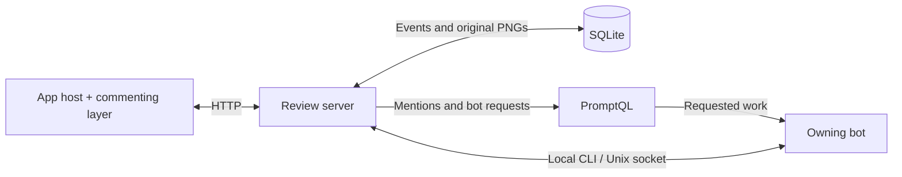

# Live commenting

Live commenting adds shared discussions to generated JavaScript apps: documents,
wireframes, dashboards, charts and graphs. Reviewers point to content, discuss it
in place, and can ask the owning PromptQL bot to act on their feedback. Comments
keep their original context as the app and its data evolve.

This README describes the capabilities, user experience and overall design.
An agent integrating the library should read it together with
[INSTRUCTIONS.md](INSTRUCTIONS.md), which supplies the setup steps, annotation
contract, chart checklist and PromptQL deployment instructions. Maintainers
changing the library itself should also read [AGENT.md](AGENT.md).

## Reviewing an app

Turn on **Comment** mode, then click a target, select text, or draw a rectangle.
The selection opens a composer beside it. Write a comment and post it; its marker
opens the discussion for reading, replying, resolving or reopening. Replying to
a resolved discussion reopens it and records that change in the history.

The target determines what each gesture means:

| Target | Click | Drag |
|---|---|---|
| An element, such as a card, table cell or button | Comment on the element | No partial element selection |
| A text block | Comment on the block | Select words or passages |
| An image, including a chart supplied only as an image | Comment on the image | Select a rectangle and preserve its image |
| A chart with a data adapter | Select one data mark; an empty spot targets the whole chart | Select the marks intersecting a rectangle and preserve its image |
| A declared label, legend entry or control inside a chart | Comment on that UI element | No text or chart-region selection from that element |

A chart mark can represent an observation, bar, pie sector, heatmap cell, graph
node or link. For rectangle selections, a point's center must be inside the box;
other shapes use their rendered geometry. HTML titles and subtitles outside the
plot can be ordinary text targets. Axes and ticks are left to whole-chart comments.

Comment mode owns these gestures, so clicking a chart control comments on it
without activating it. Turn Comment mode off to use the app's controls, pan or
zoom a chart, or move graph nodes. Existing discussions remain readable outside
Comment mode. A draft can be widened to a declared parent element or to the
whole chart.

The toolbar can hide comments, include resolved discussions, and open
**Unanchored** discussions. Nearby markers share a badge with a count; opening
it shows their discussions. Narrow screens use bottom sheets. By default,
desktop Enter posts and Shift+Enter adds a line; mobile Enter adds a line and
the reviewer uses the Comment or Reply button to post.

## Selections as content changes

Selections have a saved meaning and a current location. The app supplies stable
element IDs and chart data keys; the library uses them to find the content again
and place the marker. Preserving those identities through app updates is what
makes comments survive rerenders, reordering and layout changes.

### Chart points and rectangles

A **point selection** follows one data item's key. For example, an observation
identified by series and date remains the same observation when its value
changes. Its marker moves with it, and its individual mark is highlighted.

A **rectangle selection** freezes the selected members when the reviewer draws
it. The library subsequently draws an enclosure around the selected members
that are still visible, with the marker attached to that enclosure. It does not
outline every member, including when the discussion is open or only one member
remains visible. This keeps dense charts readable.

The rectangle chooses a fixed set of members. Suppose a reviewer selects the
Billing and Reports bars. If the categories reorder, the enclosure follows
those two bars. A new Alerts bar between them may lie inside the enclosure, but
it does not join the selection. The saved member list remains authoritative;
the original image records the view at selection time.

The same rule applies to continuous axes, pie sectors, Sankey links and force
layouts. It does not depend on the chart having a deterministic layout.

### Original context and current availability

Rectangle selections on both images and charts preserve an original PNG crop.
Chart selections also preserve each selected member's key, readable label and
supplied values. The discussion shows the image first. For multiple members,
one **“N data points”** disclosure contains their saved details and how many
remain visible. A single member's details appear directly. Changed values appear
alongside the saved values when the current member is available.

| Change | Result |
|---|---|
| Some selected chart members disappear or leave the chart's view | The enclosure follows the remaining members; the original member list and image stay intact. |
| All selected members are unavailable, or the target element is removed | The discussion moves to Unanchored. It reattaches when the target returns and, for chart selections, at least one selected member is visible. |
| A target scrolls off screen or its section is collapsed | Its marker is hidden; this alone does not make it Unanchored. |
| An image resizes | Its rectangle follows the same relative region. Replacing the image does not identify or track objects within it. |
| Selected text changes | The library requires the saved quote at its saved position in the text block; a mismatch makes that reference unanchored. |

Unanchored discussions retain their comments, replies and selection history.
An open reply stays intact while its chart selection loses or regains an anchor.
The original image and values are historical records and are never replaced by
the latest rendering.

### When data membership is unavailable

A chart supplied only as an image is an ordinary image target. A new rectangle
on a rendered chart whose adapter cannot provide reliable membership also
records an image region. It keeps a position relative to the chart, with a saved
PNG, and does not follow particular data items. An empty rectangle likewise
stays empty when data later appears inside it. Existing selections of data
members retain their identities and become Unanchored if they cannot be located.

Image capture must succeed before a rectangle comment is posted. If capture
fails, the composer keeps the draft and offers an explicit retry in the current
view. Capture quality depends on the source being readable by the browser and,
where needed, the chart renderer's export support.

## Collaboration and PromptQL

Reviewers share discussions and a “Viewing now” presence indicator. The host
polls for updates, pauses while the tab is in the background, and catches up
when it becomes visible again. Saved discussion links open the relevant thread.

Mentioning the owning bot, or choosing **“Post directly to …”**, requests its
work. Human mentions notify those people without requesting a bot response.
Ordinary comments stay in the app; bot replies and resolve/reopen actions do not
send another chat message. The waiting indicator ends when the bot contributes
to the discussion or delivery fails.

The server saves the comment before sending a PromptQL notification or request.
A delivery failure keeps the saved comment and records the error in the thread;
it is not retried automatically. The bot can read the discussion and its
original image, update the app, and reply or resolve through the local CLI.
Its instructions determine what work to carry out and when to resolve a thread.

If saving fails, the composer retains the unsent draft. When a new app build is
available, the host prompts the reviewer to refresh. Unsent drafts live in the
current tab and should be copied before refreshing; saved discussions remain in
the database.

## How the pieces fit

The artifact declares commentable elements and, for charts, exposes data keys
and current geometry through an adapter. The browser library owns selection,
highlights, markers and discussion UI. The app host supplies the authenticated
viewer and shared annotation state, and saves changes through the review server.
Chart libraries remain the app's choice; they are not bundled into commenting.



The [reference host](fixture/src/App.tsx), [server](fixture/server.mjs) and
[bot CLI](fixture/scripts/anno.mjs) implement this flow. SQLite stores the shared
event history, selection references and original PNGs. The browser rebuilds
discussion state from those events and derives marker positions from the
current page. Live chart geometry, marker grouping and visibility are not saved
as selection identity. Keeping the database and stable IDs preserves discussions
across app rebuilds.

The server implements the PromptQL boundary directly: viewer identity,
participant lookup, authorization and notification delivery. The gateway
authenticates each viewer. App publication and bot access are separate setup
steps covered in [INSTRUCTIONS.md](INSTRUCTIONS.md#6-run-and-publish-in-promptql).

## Explore the examples

The fixture is a working app using the same commenting layer and server. It
starts with simple patterns and adds harder layouts and renderer cases:

| Examples | What they demonstrate |
|---|---|
| [Document and embedded wireframe](fixture/src/fixture/SpecPage.tsx) | Prose, nested elements, tables, controls, image regions and scrolling |
| [Bar](fixture/src/fixture/charts/SimpleBar.tsx), [line](fixture/src/fixture/charts/SimpleLine.tsx), [pie](fixture/src/fixture/charts/SimplePie.tsx), [scatter](fixture/src/fixture/charts/SimpleScatter.tsx) | Small datasets with stable identities and straightforward chart integration |
| [Relationship graph](fixture/src/fixture/charts/RelationshipGraph.tsx) | The same nodes and links in force and Sankey layouts, using SVG or Canvas |
| [Image-only chart](fixture/src/fixture/charts/ImageOnlyExample.tsx) | Image-region commenting without data membership |
| [Advanced charts](fixture/src/fixture/charts/ChartExamples.tsx) | Dense series, composition, heatmaps, hierarchy, renderer changes and opt-in WebGL |

To explore locally with Node 24:

```sh
cd fixture
npm ci
npm run dev
```

Open `http://localhost:5180/`. The development harness uses the real host and
SQLite server with simulated PromptQL identity and API responses. Its database
is temporary; stopping the harness discards it. For a review session whose
comments must survive restarts, use the persistent server setup in
[INSTRUCTIONS.md](INSTRUCTIONS.md#6-run-and-publish-in-promptql).

The browser and server suites exercise these same local integration paths.
Publishing an app still requires a smoke test through the real PromptQL gateway
and bot, including viewer consent, a bot-directed comment and its reply. Test
commands and coverage live in [AGENT.md](AGENT.md#check-suites).

## Distribution and limits

The browser layer uses React 19 and can also be mounted beside a non-React SPA.
Use the repository as an app template, or build an npm-installable `.tgz` for a
separate app. That generated, Git-ignored package contains the browser library;
the matching repository supplies the server and CLI. See
[installation instructions](INSTRUCTIONS.md#1-choose-how-to-integrate).

The reference server runs as one process with a persistent SQLite data directory.
Selection images are limited to 1200 pixels per side and 2 MB; selection metadata
is limited to 6 MB and 50,000 members. HTML and SVG chart labels can be independent
targets; labels drawn only in Canvas do not have component-level targeting.
WebGL depends on browser/device support and is opt-in in the fixture. Mobile
automated checks use Chromium emulation, not physical devices.

The current release candidate is **6.0.0**. Package versions and release tags
follow SemVer (`6.0.0` / `v6.0.0`), using `fixture/package.json` as the version
source. See [CHANGELOG.md](CHANGELOG.md) for changes and earlier milestones, and
[third-party notices](fixture/THIRD_PARTY_NOTICES.md) for dependency licences.
